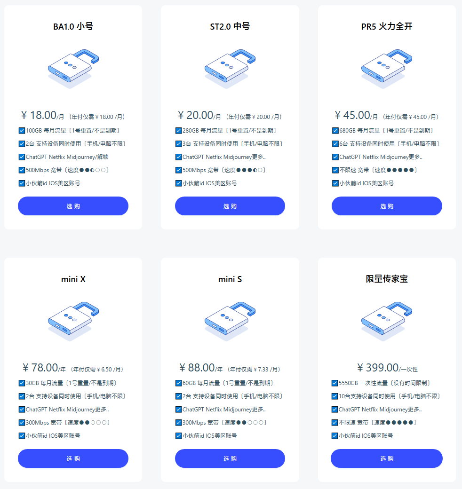

# zzsj掌中世界加速器官网地址 + 最新优惠码

永久官网：[zzsjjsq.com](https://www.zzsj3.com/user/register?code=AeZOm0ac)

备用地址：[zzsj.vip](https://www.zzsj4.com/user/register?code=AeZOm0ac)

> 掌中世界跑路了吗？暂时没有。不过机场总会有跑路风险，为尽可能减少损失，选购套餐可按月支付。
> 另外没有啥绝对好坏，一线机场也会炸，小机场也可能岁月静好。

## zzsj掌中世界加速器介绍

掌中世界加速器使用IPLC国际专线，精心优化传输算法，速度更快更稳定。节点解锁Netflix、Tiktok等流媒体服务。

支持 Android、iOS、MacOS、Windows、Linux、路由器。另外掌中世界机场拥有自己的客户端，操作非常便捷，登录账号后，一键就能连接，非常适合新手小白。

### zzsj掌中世界加速器特点

<ul>
    <li>从入口到落地精选优质运营商，多层线路优化，负载均衡设定；</li>
    <li>套餐配置灵活，价格优惠月付6.5元至45元，极具性价比；</li>
    <li>最先进流量隐藏技术，将VPN穿墙流量化身网页浏览，免于防火墙干扰；</li>
    <li>支持 Netflix、TVB 等国外流媒体以及 ChatGPT 解锁；</li>
    <li>支持 Windows、Mac、Linux、Android、iOS 等全平台加速器客户端；</li>
    <li>多组服务器集群覆盖多个国家地区，从 10+ 个国家地区的 34 组服务器集群中任意选择；</li>
</ul>

## 掌中世界优惠码

套餐价格已经很便宜，目前暂无特殊优惠。

## 掌中世界套餐价格

掌中世界vpn套餐最低仅￥6.5/月，每月30G流量。

||BA1.0 小号|ST2.0 中号|PR5 火力全开|mini X|mini S|king|
|----|----|----|----|----|----|----|
|月付|￥18|￥20|￥45|-|-|-|
|季付|￥54|￥60|￥114|-|-|-|
|半年付|￥108|￥120|￥288|-|-|-|
|年付|￥216|￥240|￥576|￥78|￥88|-|

还有类似[魔戒](https://mojie.page)的传家宝套餐：￥399/一次性 5550GB流量〔没有时间限制〕

[king流量包](https://xuv.cc/out/zzsj) ￥299.00/两年，一次性2088GB流量〔2年内有效〕，不限速。

## 掌中世界机场好用吗？

掌中世界机场速度怎么样？运营几年，也是老牌机场了，速度、稳定性都不错，全节点解锁ChatGPT和Netflix等流媒体。
